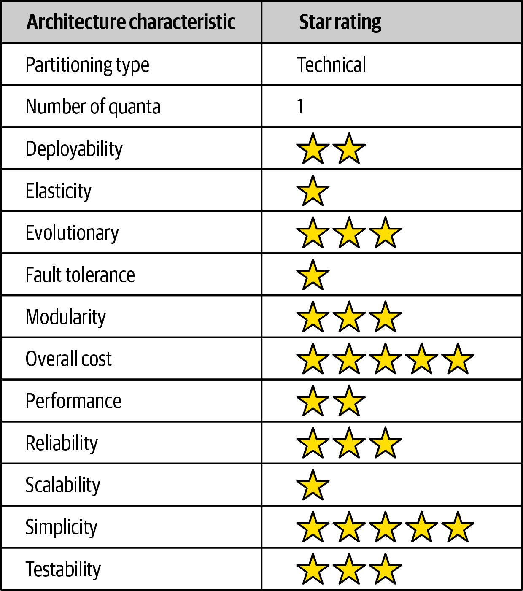

## Part 1: Foundations

### Chapter 1: Introduction
1. *What are the four dimensions that define software architecture?*  

   Software architecture consists of the structure of the system (foundations supporting the architecture), 
   combined with architecture characteristics (“-ilities”) the system must support, architecture decisions, 
   and finally design principles.  

2. What is the difference between an architecture decision and a design principle?  

   Architecture decisions define the rules for how a system should be constructed. A design principle
   differs from an architecture decision in that a design principle is a guideline rather
   than a hard-and-fast rule.  

3. *List the eight core expectations of a software architect.*

   Architect should:
    - Make architecture decisions
    - Continually analyze the architecture
    - Keep current with latest trends
    - Ensure compliance with decisions
    - Have diverse exposure and experience
    - Have business domain knowledge
    - Possess interpersonal skills
    - Understand and navigate politics  

4. *What is the First Law of Software Architecture?*  

   "Everything in software architecture is a trade-off."  
   Alternatively, it can be said that "If an architect thinks they have discovered something that isn’t a trade-off, more likely
   they just haven’t identified the trade-off yet".  

### Chapter 2: Architectural Thinking
1. *Describe the traditional approach of architecture versus development and
explain why that approach no longer works.*  

   (Short answer: traditional approach looks like waterfall: architect builds a set of artifacts, based on which development
   is done, without any feedback loop, revisiting initial assumptions or next iterations. It is completely unfit to modern,
   iterative methodologies for software development.)   
   Long answer:
   Traditionally, an architect is responsible for things like analyzing business requirements to extract and define 
   the architectural characteristics (“-ilities”), selecting which architecture patterns and styles
   would fit the problem domain, and creating components (the building blocks of the system). 
   The artifacts created from these activities are then handed off to the development team, 
   which is responsible for creating class diagrams for each component, creating user interface screens, 
   and developing and testing source code. It is the unidirectional arrow passing though the virtual and physical barriers 
   separating the architect from the developer that causes all of the problems associated with architecture. 
   Decisions an architect makes sometimes never make it to the development teams, and decisions development teams make that
   change the architecture rarely get back to the architect. In this model the architect is disconnected 
   from the development teams, and as such the architecture rarely provides what it was originally set out to do.  

2. *List the three levels of knowledge in the knowledge triangle and provide an
example of each.*  

   The top and the smallest one is "what you know". Below that, there is bigger one "what you know you don't know".
   The bottom and the biggest one is "what you don't know you don't know".  

3. *Why is it more important for an architect to focus on technical breadth rather
than technical depth?*  

   Because architects must make decisions that match capabilities to technical constraints, a broad understanding
   of a wide variety of solutions is valuable. Architects should focus on technical breadth so that they have a larger
   quiver from which to draw arrows.  
   (But they won't be actually firing those arrows themselves, so they don't need to know every nut and bolt.)  

4. *What are some of the ways of maintaining your technical depth and remaining hands-on as an architect?*  

   (Definitely not taking ownership of a code on a critical path for a project, which would require being both architect
   and lead developer at the same time, probably leading not only to overtime and burnout, but also blocking progress
   in at least one of those two areas. This is called bottleneck trap.)  
   There are several ways:
    - delegate the critical path and framework code to others on the development team and then
      focus on coding a piece of business functionality (a service or a screen) one to three
      iterations down the road
    - do frequent proof-of-concepts (POCs), but strive for production-quality code
    - tackle some of the technical debt stories or architecture stories, freeing the development team up 
      to work on the critical functional user stories
    - working on bug fixes within an iteration
    - automation by creating simple command-line tools and analyzers to help the development team 
      with their day-to-day tasks
    - do frequent code reviews
    - "practice coding from home"
    - (cool idea would be to have hackathons where roles are switched, e.g. architects and QAs code while
      developers architect and test)

### Chapter 3: Modularity
1. *What is meant by the term connascence?*  

   "Two components are connascent if a change in one would require the other to be
   modified in order to maintain the overall correctness of the system."  
   Meilir Page-Jones  

2. *What is the difference between static and dynamic connascence?*  

   Static connascence refers to source-code-level coupling, while dynamic connascence refers to execution-time
   coupling.  

3. *What does connascence of type mean? Is it static or dynamic connascence?*  

   CoT is a static connascence meaning that multiple components must agree on the type of an entity. 
   Typically in statically typed languages this is checked at compile-time.  
   In Python I think it's more a connascence of interface/protocol, which can be checked before runtime, 
   but might also result in runtime errors.  

4. *What is the strongest form of connascence?*  

   Strength of connascence is defined by the ease with which a developer can refactor that type of coupling.
   Dynamic connascence is stronger than static connascence, and out of all types of dynamic connascence the strongest is
   Connascence of Identity (CoI), which occurs when multiple components must reference the same entity.  

5. *What is the weakest form of connascence?*  

   Connascence of Name (CoN) - multiple components must agree on the name of an entity.
   Names of methods represents the most common way that code bases are coupled
   and the most desirable, especially in light of modern refactoring tools that make
   system-wide name changes trivial.  

6. *Which is preferred within a code base—static or dynamic connascence?*  

   Static connascence is strongly preferred, as it is much easier to analyze call graph over  runtime calls.
   Maybe with better tooling and observability this wouldn't be as much of an issue.

### Chapter 4: Architecture Characteristics Defined
1. *What three criteria must an attribute meet to be considered an architecture characteristic?*  

    - Specifies a non-domain design consideration
    - Influences some structural aspect of the design
    - Is critical or important to application success  

2. *What is the difference between an implicit characteristic and an explicit one?
Provide an example of each.*  

   Implicit ones rarely appear in requirements, yet they’re necessary
   for project success. For example, availability, reliability, and security underpin virtually all applications, 
   yet they’re rarely specified in design documents. Explicit architecture characteristics appear in requirements
   documents or other specific instructions.  

3. *Provide an example of an operational characteristic.*  

   Availability, Continuity, Performance, Recoverability, Reliability/safety, Robustness, Scalability.  

4. *Provide an example of a structural characteristic.*  

   Configurability, Extensibility, Installability, Leverageability/reuse, Localization, Maintainability, Portability,
   Supportability, Upgradeability  

5. *Provide an example of a cross-cutting characteristic.*  

   Accessibility, Archivability, Authentication (ensure users are who they say they are), 
   Authorization (ensure users can access only certain functions withing the application), Legal, Privacy, Security,
   Supportability, Usability/achievability  

6. *Which architecture characteristic is more important to strive for — availability or performance?*  

   It depends ;) "never shoot for the best architecture, but rather *the least worst* architecture"  

### Chapter 5: Identifying Architecture Characteristics
1. *Give a reason why it is a good practice to limit the number of characteristics 
(“-ilities”) an architecture should support.*  

   Each architecture characteristic the architecture support complicates the overall system design; supporting too many
   leads to greater complexity before even starting to address the problem domain (the original problem motivation
   for writing the software in the first place).  

2. *True or false: most architecture characteristics come from business requirements and user stories.*  

   Most architecture characteristics come from listening to key domain stakeholders and collaborating with them
   to determine what is important from a domain perspective. While this may seem like a straightforward activity,
   the problem is that architects and domain stakeholders speak different languages.  

3. *If a business stakeholder states that time-to-market (i.e., getting new features and
bug fixes pushed out to users as fast as possible) is the most important business
concern, which architecture characteristics would the architecture need to support?*  

   Agility, testability, deployability.  

4. *What is the difference between scalability and elasticity?*  

   Scalability is the ability to handle a large number of concurrent users without serious performance degradation,
   while elasticity is the ability to handle bursts of requests.  

5. *You find out that your company is about to undergo several major acquisitions to
significantly increase its customer base. Which architectural characteristics
should you be worried about?*  

   Interoperability, scalability, adaptability, extensibility.  

### Chapter 6: Measuring and Governing Architecture Characteristics
1. *Why is cyclomatic complexity such an important metric to analyze for architecture?*

   Architects and developers universally agree that overly complex code represents a code smell;
   it harms virtually every one of the desirable characteristics of code bases: modularity, testability and so on.  

2. *What is an architecture fitness function? How can they be used to analyze an
architecture?*  

   Any mechanism that provides an objective integrity assessment of some architecture characteristic 
   or combination of architecture characteristics.  

3. *Provide an example of an architecture fitness function to measure the scalability
of an architecture.*  

   (One possible fitness function would be a change of a performance metric (such as requests per second or throughput)
   under load in comparison to baseline value divided by change of resources assigned.
   Perfectly scalable system would get a value of 1.)  

4. *What is the most important criteria for an architecture characteristic to allow
architects and developers to create fitness functions?*  

   Measurability, it needs to be possible to objectively measure.  

### Chapter 7: Scope of Architecture Characteristics
1. *What is an architectural quantum, and why is it important to architecture?*  

   An independently deployable artifact with high functional cohesion and synchronous connascence,
   i.e. part of the system (consisting of services, databases etc.) that can be deployed and removed on its own,
   doing something purposeful (like a business capability or a workflow) synchronously coupled within this subsystem.   

2. *Assume a system consisting of a single user interface with four independently
deployed services, each containing its own separate database. Would this system
have a single quantum or four quanta? Why?*  

   Assuming that services are correctly split and each of them encompasses a separate bounded context,
   system would have four quanta, due to deployment independence and separation.   

3. *Assume a system with an administration portion managing static reference data
(such as the product catalog, and warehouse information) and a customer-facing portion managing the placement of orders. 
How many quanta should this system be and why?
If you envision multiple quanta, could the admin quantum and customer-facing quantum share a database?
If so, in which quantum would the database need to reside?*  

   Preferred solution would be to have 2 quantas, as architecture characterics such as scalability and elasticity are
   vastly higher for customer-facing portion than for administration side. Also static data might need to be optimized
   for fast reads and searchability.  
   However, if cost management is important characteristic then I would suggest having database in quantum with higher
   requirements and performing separate update procedures from the second quantum.  

### Chapter 8: Component-Based Thinking
1. *We define the term component as a building block of an application — something the application does.
A component usually consist of a group of classes or source files.
How are components typically manifested within an application or service?*  

   Simplest form of component is a library, which just wraps code at higher level of modularity then classes or objects.
   Components also appear as subsystems, layers or services.  

2. *What is the difference between technical partitioning and domain partitioning?
Provide an example of each.*  

   Technical partitioning means that on the top-level, functionality of the system is devided into technical capabilities:
   presentation, business rules, services, persistence and so on (example is Model-View-Controller and variants).
   In domain partitioning top-level division is around domains or workflows, for example e-commerce application
   could be divided into CatalogCheckout, UpdateInventory, ShipToCustomer, Reporting, Analytics, UpdateAccounts.  

3. *What is the advantage of domain partitioning?*  

   Each of the workflows is encapsulated within a single top-level component,
   which better reflects the kinds of changes that most often occur in the projects.  

4. *Under what circumstances would technical partitioning be a better choice over domain partitioning?*  

   It offers clear separation of technical concerns, which in turn creates useful levels of decoupling: change in one layer
   might only affect neighbouring layers. This style of partitioning provides a decoupling technique, reducing rippling
   side effects on dependent components. It also enables developers to find certain categories of the code 
   in the code base quickly, as it is organized by capabilities, which is better where we have separate departments 
   like Database Administration, Backend Development, Presentation etc.  

5. *What is the entity trap? Why is it not a good approach for component identification?*  

   Is it as anti-pattern where components are structured around entities, while in real world database relationships
   are typically a different thing than actual workflows in the application.  
   Components created with the entity trap also tend to be too coarse-grained, offering no guidance whatsover
   to the development team in terms of the packaging and overall structuring of the source code.  

6. *When might you choose the workflow approach over the Actor/Actions approach when identifying core components?*  

   Actor/Actions approach fits well more traditional software development processes with significant upfront design,
   where requirements feature distinct roles and the kinds of actions they can perform. Workflow approach suits better
   teams using Agile software development.  

## Part 2: Architecture Styles

### Chapter 9: Architecture Styles
1. *List the eight fallacies of distributed computing.*  
   1. The network is reliable
   2. Latency is zero
   3. Bandwidth is infinite
   4. The network is secure
   5. Topology doesn't change
   6. There is one administrator
   7. Transport cost is zero
   8. The network is homogeneous  
   
2. *Name three challenges that distributed architectures have that monolithic architectures don’t.*  

   Distributed logging, distributed transactions, contract maintenance and versioning.  

3. *What is stamp coupling?*  

   Stamp coupling occurs when modules or components are passing whole data structure 
   instead of just the actual data that caller needs.  

4. *What are some ways of addressing stamp coupling?*
    - Create private (more granular) RESTful API endpoints
    - Use field selectors in the contract
    - Use GraphQL to decouple contracts
    - Use value-driven contracts with consumer-driver contracts (CDCs)
    - Use internal messaging endpoints
   

### Chapter 10: Layered Architecture Style

Scorecard

1. *What is the difference between an open layer and a closed layer?*  

   Each layer in the layered architecture style can be either closed or open.
   A closed layer means that as a request moves top-down from layer to layer,
   the request cannot skip any layers, but rather must go through the layer immediately below it to get to the next layer. 
   At the other hand, open layer allows requests to bypass itself and call directly the layer below it.  

2. *Describe the layers of isolation concept and what the benefits are of this concept.*  

   The layers of isolation concept means that changes made in one layer of the architecture generally don’t impact
   or affect components in other layers, providing the contracts between those layers remain unchanged. (loose coupling) 
   Each layer is independent of the other layers, thereby having little or no knowledge of the inner workings 
   of other layers in the architecture. However, to support layers of isolation, 
   layers involved with the major flow of the request necessarily have to be closed.  
   The layers of isolation concept also allows any layer in the architecture to be replaced
   without impacting any other layer (again, assuming well-defined contracts and the use of the business delegate pattern).
     

3. *What is the architecture sinkhole anti-pattern?*  

   This anti-pattern occurs when requests move from layer to layer as simple pass-through processing 
   with no business logic performed within each layer. This results in unnecessary object instantiation and processing, 
   impacting both memory consumption and performance.  
   Every layered architecture will have at least some scenarios that fall into this case.
   The key to determining whether the architecture sinkhole anti-pattern is at play is to analyze 
   the percentage of requests that fall into this category. If 80% of the requests are sinkholes, 
   it a good indicator that the layered architecture is not the correct architecture style for the problem domain.  

4. *What are some of the main architecture characteristics that would drive you to use a layered architecture?*  

   Low overall cost and simplicity.  
   Being monolithic in nature, layered architectures don’t have the complexities associated with distributed architectures, 
   are simple and easy to understand, and are relatively low cost to build and maintain. 
   However, these ratings start to quickly diminish as monolithic layered architectures get bigger and more complex.  

5. *Why isn’t testability well-supported in the layered architecture style?*  

   As monoliths are single deployment units, even the smallest changes requires redeploying, and therefore testing,
   of the entire unit. Typically, a lot of changes are being introduced to production at the same time,
   which makes it harder to investigate and debug. This is partially eased by ability to mock or stub components,
   or even entire layers.  

6. *Why isn’t agility well-supported in the layered architecture style?*  

   Agility, i.e. ability to respond quickly to change, is not supported well because any particular business domain is
   spread throughout all of the layers of the architecture, making it difficult to apply changes to that domain.  

### Chapter 11: Pipeline Architecture

Scorecard

1. *Can pipes be bidirectional in a pipeline architecture?*  

   Typically pipes are unidirectional, forming one-way communication between filters, 
   usually in a point-to-point fashion.  

2. *Name the four types of filters and their purpose.*
   - Producer (sometimes called the source): the starting point of a process, outbound only
   - Transformer: accepts input, optionally performs a transformation on some or all of the data,
     then forwards it to the outbound pipe (analogous to *map*)
   - Tester: accepts input, tests one or more criteria, then optionally produces output, based on the result of the test
     (analogous to *reduce*)
   - Consumer: the termination point for the pipeline flow; it may persist the final result to a database, 
     serialize to file or display on a user interface
     

3. *Can a filter send data out through multiple pipes?*  

   Yes.  

4. *Is the pipeline architecture style technically partitioned or domain partitioned?*

   Technically partitioned architecture due to the partitioning of application logic into filter types 
   (producer, tester, transformer, and consumer).  

5. *In what way does the pipeline architecture support modularity?*  

   Architectural modularity is achieved through the separation of concerns between the various filter types 
   and transformers. Any of these filters can be modified or replaced without impacting the other filters.  

6. *Provide two examples of the pipeline architecture style.*  

   ETL tools (extract, transform, and load) leverage the pipeline architecture as well for the flow 
   and modification of data from one database or data source to another.  
   Orchestrators and mediators such as Apache Camel utilize the pipeline architecture to pass information 
   from one step in a business process to another.  

### Chapter 12: Microkernel Architecture

Scorecard

1. *What is another name for the microkernel architecture style?*  

   *Plug-in* architecture.  

2. *Under what situations is it OK for plug-in components to be dependent on other plug-in components?*

   Ideally, plug-in components should be independent of each other and have no dependencies between them.  

3. *What are some of the tools and frameworks that can be used to manage plug-ins?*  

   Runtime plug-in components can be added or removed at runtime without having to redeploy the core system 
   or other plug-ins, and they are usually managed through frameworks such as Open Service Gateway Initiative (OSGi) 
   for Java, Penrose (Java), Jigsaw (Java), or Prism (.NET).  

4. *What would you do if you had a third-party plug-in that didn’t conform to the
standard plug-in contract in the core system?*  

   You can create an adapter between plug-in contract and standard contract, so that core system does not need to be 
   specialized in any way.  

5. *Provide two examples of the microkernel architecture style.*  

   A product or application that places a strong emphasis on user customization and feature extensibility 
   (such as Jira or an IDE like Eclipse). Another example of a large and complex business application
   is tax preparation software.  

6. *Is the microkernel architecture style technically partitioned or domain partitioned?*  

   While most microkernel architectures are technically partitioned, the domain partitioning aspect comes about mostly 
   through a strong domain-to-architecture isomorphism. For example, problems that require different configurations 
   for each location or client match extremely well with this architecture style.  

7. *Why is the microkernel architecture always a single architecture quantum?*  

   The number of quanta is always singular (one) because all requests must go through the core system
   to get to independent plug-in components.  

8. *What is domain/architecture isomorphism?*  
   
   It's the relation between problem domain and software architecture, some architecture style are inherently better
   fitting to some particular domains and vice versa.  

### Chapter 13: Service-Based Architecture

Scorecard

1. *How many services are there in a typical service-based architecture?*  

   Because the services typically share a single monolithic database, the number of services within 
   an application context generally range between 4 and 12 services, with the average being about 7 services.  

2. *Do you have to break apart a database in service-based architecture?*  

   No, usually services share a single, monolithic database. This database coupling can present an issue with respect to
   database table schema changes. If not done properly, a table schema change can potentially impact every service, 
   making database changes a very costly task in terms of effort and coordination.  

3. *Under what circumstances might you want to break apart a database?*  

   Opportunities may exist to break apart a single monolithic database into separate databases, 
   even going as far as domain-scoped databases matching each domain service (similar to microservices). 
   In these cases it is important to make sure the data in each separate database is not needed by another domain service. 
   This avoids interservice communication between domain services (something to definitely avoid with 
   service-based architecture) and also the duplication of data between databases.  

4. *What technique can you use to manage database changes within a service-based architecture?*  

   The practice of creating a single shared library of entity objects is the least effective way of implementing 
   service-based architecture. Any change to the database table structures would also require a change to the single
   shared library containing all of the corresponding entity objects, thus requiring a change and redeployment 
   to every service, regardless of whether or not the services actually access the changed table.
   One way to mitigate the impact and risk of database changes is to logically partition the database 
   and manifest the logical partitioning through federated shared libraries. Using this technique, changes to a table 
   within a particular logical domain match the corresponding shared library containing the entity objects 
   (and possibly SQL as well), impacting only those services using that shared library. 
   No other services are impacted by this change.  
   Tip: Make the logical partitioning in the database as fine-grained as possible while still maintaining 
   well-defined data domains to better control database changes within a service-based architecture.  

5. *Do domain services require a container (such as Docker) to run?*  

   No, services within this architecture style are typically coarse-grained “portions of an application” 
   (usually called domain services) that are independent and separately deployed. Services are typically deployed 
   in the same manner as any monolithic application would be (such as an EAR file, WAR file, or assembly) 
   and as such do not require containerization (although you could deploy a domain service in a container
   such as Docker).  

6. *Which architecture characteristics are well-supported by the service-based architecture style?*  

   Breaking apart an application into separately deployed domain services using this architecture style allows
   for faster change (agility), better test coverage due to the limited scope of the domain (testability), 
   and the ability for more frequent deployments carrying less risk than a large monolith (deployability). 
   These three characteristics lead to better time-to-market, allowing an organization to deliver new features 
   and bug fixes at a relatively high rate.  
   Fault tolerance and overall application availability also rate high for service-based architecture.
   It also tends to be more reliable than other distributed architectures due to the coarse-grained nature 
   of the domain services.  
   Simplicity and overall cost are two other drivers that differentiate this architecture style from other, 
   more expensive and complex distributed architectures, such as microservices, event-driven architecture, 
   or even space-based architecture. This makes service-based one of the easiest and cost-effective 
   distributed architectures to implement.  

7. *Why isn’t elasticity well-supported in a service-based architecture?*  

   Although programmatic scalability and elasticity are certainly possible with this architecture style, 
   more functionality is replicated than with finer-grained services (such as microservices) and as such is not as
   efficient in terms of machine resources and not as cost-effective. Typically, there are only single service instances 
   with service-based architecture unless there is a need for better throughput or failover.  

8. *How can you increase the number of architecture quanta in a service-based architecture?*  

   Being a distributed architecture, the number of quanta can be greater than or equal to one. 
   Even though there may be anywhere from 4 to 12 separately deployed services, if those services all share 
   the same database or user interface, that entire system would be only a single quantum. However, 
   both the user interface and database can be federated, resulting in multiple quanta within the overall system.  

### Chapter 14: Event-Driven Architecture Style

Scorecard

1. *What are the primary differences between the broker and mediator topologies?*  

   In mediator topology there is a central event mediator, which provides control over the workflow of an event process, 
   whereas the broker topology does not have any central component and rather uses the distributed message flow,
   which can result in high degree of responsiveness and dynamic control over the processing of an event.  

2. *For better workflow control, would you use the mediator or broker topology?*  

   Mediator topology.  

3. *Does the broker topology usually leverage a publish-and-subscribe model with topics
or a point-to-point model with queues?*

   Pub-sub with topics.  

4. *Name two primary advantage of asynchronous communications.*  
   
   - improved scalability and responsiveness
   - increased fault tolerance and resilience
     

5. *Give an example of a typical request within the request-based model.*  

   Requests are published as *commands*, such as place-order, send-email and fulfill-order.  

6. *Give an example of a typical request in an event-based model.*  

   Requests are published as *events* that had already occurred in the system (such as order-created, 
   payment-applied and email-sent)  

7. *What is the difference between an initiating event and a processing event in event-driven architecture?*  

   Initiating events starts the process, while processing event marks that one of the steps has been done.  

8. *What are some of the techniques for preventing data loss when sending and receiving messages from a queue?*
   
   - persistent message queues
   - synchronous send
   - client acknowledge mode
   - last participant support
     

9. *What are three main driving architecture characteristics for using event-driven architecture?*   

   Evolutionary, fault tolerance and scalability.  

10. *What are some of the architecture characteristics that are not well-supported in event-driven architecture?*  

   Overall simplicity and testability rate relatively low with event-driven architecture,
   mostly due to the nondeterministic and dynamic event flows typically found within this architecture style.  

### Chapter 15: Space-Based Architecture

Scorecard

1. *Where does space-based architecture get its name from?*  

   Space-based architecture gets its name from the concept of *tuple space*, the technique
   of using multiple parallel processors communicating through shared memory.  

2. *What is a primary aspect of space-based architecture that differentiates it from other architecture styles?*  

   Application data is kept in-memory and replicated among all the active processing units. 
   When a processing unit updates data, it asynchronously sends that data to the database, 
   usually via messaging with persistent queues.  

3. *Name the four components that make up the virtualized middleware within a space-based architecture.*  
   
   - Messaging Grid
   - Data Grid
   - Processing Grid
   - Deployment Manager
     

4. *What is the role of the messaging grid?*  

   The messaging grid, manages input request and session state. When a request comes into the virtualized middleware, 
   the messaging grid component determines which active processing components are available to receive the request 
   and forwards the request to one of those processing units.  

5. *What is the role of a data writer in space-based architecture?*  

   The data writer component accepts messages from a data pump and updates the database with the information contained 
   in the message of the data pump.  

6. *Under what conditions would a service need to access data through the data reader?*  

   In space-based architecture, data readers are only invoked under one of three situations:
   a crash of all processing unit instances of the same named cache, 
   a redeployment of all processing units within the same named cache, 
   or retrieving archive data not contained in the replicated cache.  

7. *Does a small cache size increase or decrease the chances for a data collision?*  

   Increase.  

8. *What is the difference between a replicated cache and a distributed cache? 

   Which one is typically used in space-based architecture?*  
   Space-based architecture mostly relies on replicated caching, although distributed caching can be used as well.
   Replicated caching works in internal memory, while distributed caching requires an external serves or service dedicated
   to holding a centralized cache.  

9. *List three of the most strongly supported architecture characteristics in spacebased architecture.*  

   Elasticity, scalability and performance.  
   These are the driving attributes and main advantages of this architecture style. 
   High levels of all three of these architecture characteristics are achieved by leveraging in-memory data caching 
   and removing the database as a constraint. As a result, processing millions of concurrent users is possible using this
   architecture style.  

10. *Why does testability rate so low for space-based architecture?*  

   Due to the complexity involved with simulating the high levels of scalability and elasticity supported in this 
   architecture style. Testing hundreds of thousands of concurrent users at peak load is a very complicated and expensive 
   task, and as a result most high-volume testing occurs within production environments with actual extreme load. 
   This produces significant risk for normal operations within a production environment.  

### Chapter 16: Orchestration-Driven Service-Oriented Architecture

Scorecard

1. *What was the main driving force behind service-oriented architecture?*  

   Reuse. Reuse of everything.  

2. *What are the four primary service types within a service-oriented architecture?*  
   
   - business services
   - enterprise services
   - application services
   - infrastructure services
     

3. *List some of the factors that led to the downfall of service-oriented architecture.*  

   System build primarily around reuse incurs a huge amount of coupling between components.
   Therefore, each change had a potential huge ripple effect. All the teams have to deal with extra complexity
   introduced due to having single model for diverse use cases. On the top of that, architecture so focused
   on technical partitioning results in spreading domain concepts extremely thinly throughout the system.  

4. *Is service-oriented architecture technically partitioned or domain partitioned?*  

   Extremely technically.  

5. *How is domain reuse addressed in SOA? How is operational reuse addressed?*  

   By creating shared business services and infrastructure services. If the teams needs matched, 
   then they could reuse existing service.

### Chapter 17: Microservices Architecture

Scorecard

1. *Why is the bounded context concept so critical for microservices architecture?*  

   The primary goal of microservices is high decoupling, physically  modeling the logical notion of bounded context.
   Within a bounded context, the internal parts, such as code and data schemas, are coupled together to produce work; 
   but they are never coupled to anything outside the bounded context, such as a database or class definition 
   from another bounded context. This allows each context to define only what it needs 
   rather than accommodating other constituents.  

2. *What are three ways of determining if you have the right level of granularity in a microservice?*  
   
   - Purpose: each microservice should be extremely functionally cohesive, contributing to one behaviour of the application
   - Transactions: distributed transactions cause a lot of issues, systems that avoid them tend to have better designs
   - Choreography: if services have excellent domain isolation, yet require extensive communication to function,
     they might be considered to be bundled together
        

3. *What functionality might be contained within a sidecar?*  

   Operational concerns such as monitoring, logging and circuit breakers.  

4. *What is the difference between orchestration and choreography? Which does microservices support?

   Is one communication style easier in microservices?*  
   Choreography, due to not having central coordinator in this architecture, respecting the bounded context philosophy. 
   Thus, architects find it natural to implement decoupled events between services.  

5. *What is a saga in microservices?*  

   Saga is a distributed transactional pattern, where a service acts as a mediator between multiple service calls
   and coordinates a transaction. The mediator calls each part of the transaction, records success or failure, 
   and coordinates results. If everything goes as planned, all the values in the services 
   and their contained databases update synchronously. 
   In an error condition, the mediator must ensure that no part of the transaction succeeds if one part fails.  

6. *Why are agility, testability, and deployability so well-supported in microservices?*  

   By building an architecture that has extremely small deployment units that are highly decoupled.  

7. *What are two reasons performance is usually an issue in microservices?*  

   Performance is often an issue in microservices—distributed architectures must make many network calls to complete work, 
   which has high performance overhead, and they must invoke security checks to verify identity and access for each endpoint.
     

8. *Is microservices a domain-partitioned architecture or a technically partitioned one?*  

   Domain (if done right, if not we have a distributed monolith).  

9. *Describe a topology where a microservices ecosystem might be only a single quantum.*  

   If all microservices are communicating synchronously and all services are connected within business processes.  

10. *How was domain reuse addressed in microservices? How was operational reuse addressed?*  
   Domain reuse is discouraged between bounded concepts, as it introduces coupling.
   Operational reuse is addressed through using sidecar pattern or through using shared libraries.  

### Chapter 18: Choosing the Appropriate Architecture Style
1. *In what way does the data architecture (structure of the logical and physical data models) 
influence the choice of architecture style?*  

   Architects and DBAs must collaborate on database, schema, and other data-related concerns.  

2. *How does it influence your choice of architecture style to use?*  

   If the architecture is monolithic, architects commonly assume a single relational databases or a few of them. 
   In a distributed architecture, the architect must decide which services should persist data, 
   which also implies thinking about how data must flow throughout the architecture to build workflows. 
   Architects must consider both structure and behavior when designing architecture and not be
   fearful of iterating on the design to find better combinations.  

3. *Delineate the steps an architect uses to determine style of architecture, data partitioning,
and communication styles.*  

   Analyze the following concerns:
   - the domain
   - architecture characteristics that impact structure
   - data architecture
   - organizational factors
   - knowledge of process, teams, and operational concerns
   - domain/architecture isomorphism
     
   
4. *What factor leads an architect toward a distributed architecture?*  

   Using the quantum concepts discussed earlier, the architect must determine if a
   single set of architecture characteristics will suffice for the design, or do different
   parts of the system need differing architecture characteristics? 
   A single set implies that a monolith is suitable (although other factors may drive an architect
   toward a distributed architecture), whereas different architecture characteristics
   imply a distributed architecture.  

### Chapter 19: Architecture Decisions
1. *What is the covering your assets anti-pattern?*  

   Avoiding or defering making an architecture decision out of fear of making the wrong choice.  

2. *What are some techniques for avoiding the email-driven architecture anti-pattern?*  

   The first rule of communicating architecture decisions is to not include the architecture decision in
   the body of an email. The second rule of effectively communicating architecture decisions is to only notify
   those people who really care about the architecture decision.  

3. *What are the five factors Michael Nygard defines for identifying something as architecturally significant?*

   - **Structure**: decisions that impact the pattern or styles of architecture being used.
   - **Nonfunctional characteristics**: quality attributes ("-ilities") that are important for the application or system.
   - **Dependencies**: coupling points between components and/or services within the system.
   - **Interfaces**: how services and components are accessed and orchestrated, it involves defining contracts, versioning etc.
   - **Construction techniques**: decisions about platforms, frameworks, tools and even processes.
     
   
4. *What are the five basic sections of an architecture decision record?*
   - Title
   - Status
   - Context
   - Decision
   - Consequences
   Additionally one might add:
   - Compliance
   - Notes
     

5. *In which section of an ADR do you typically add the justification for an architecture decision?*  
In the decision, as *why* decision was made is far more important than understanding *how* something works.  

6. *Assuming you don’t need a separate Alternatives section, in which section of an ADR would you list  
the alternatives to your proposed solution?*  
In the **Context** section.  

7. *What are three basic criteria in which you would mark the status of an ADR as Proposed?*  
The decision must be approved by either a higher-level decision maker or some sort of architectural governance body.

### Chapter 20: Analyzing Architecture Risk
1. *What are the two dimensions of the risk assessment matrix?*  

   Overall impact and likelihood of occurrence.  

2. *What are some ways to show direction of particular risk within a risk assessment?
Can you think of other ways to indicate whether risk is getting better or worse?*  

   One can use `+` `-` signs or up/down arrows, they can be additionally color coded to show whether change is positive
   or negative (things getting better or worse). Personally, I would put happy and sad faces,
   this might not be professional, but it's 100% clear about direction of the change.  

3. *Why is it necessary for risk storming to be a collaborative exercise?*  

   No one can single-handedly determine the overall risk of a system, because of overlooks and having only partial
   knowledge of the whole system.  

4. *Why is it necessary for the identification activity within risk storming to be an
individual activity and not a collaborative one?*  

   It is essential so that participants don’t influence or direct attention away from particular areas of the architecture.  

5. *What would you do if three participants identified risk as high (6) for a particular
area of the architecture, but another participant identified it as only medium (3)?*  

   There should be an open discussion, started by the highest risk participant explaining his point of view.
   Everyone is allowed to change their opinion during that time.  

6. *What risk rating (1-9) would you assign to unproven or unknown technologies?*  

   For unproven or unknown technologies, always assign the highest risk rating (9) since the risk matrix 
   cannot be used for this dimension.  

### Chapter 21: Diagramming and Presenting Architecture
1. *What is irrational artifact attachment, and why is it significant with respect to
documenting and diagramming architecture?*  

   Irrational Artifact Attachment is the proportional relationship between a person’s irrational attachment to some
   artifact and how long it took to produce. If an architect creates a beautiful diagram using some tool like Visio 
   that takes two hours, they have an irrational attachment to that artifact that’s roughly proportional to the amount 
   of time invested, which also means they will be more attached to a four-hour diagram than a two-hour one.
   This is dangerous at initial designs are meant to be temporary, iteratively improved and generally throw-away.  

2. *What do the 4 C’s refer to in the C4 modeling technique?*  

   - Context
   - Container
   - Component
   - Class
     

3. *When diagramming architecture, what do dotted lines between components mean?*  

   Asynchronous communication (and solid line is for synchronous).  

4. *What is the bullet-riddled corpse anti-pattern? How can you avoid this anti-pattern when creating presentations?*  

   The Presentation Patterns book calls out the Bullet-Riddled Corpse as a common antipattern of corporate presentations,
   where every slide is essentially the speaker’s notes, projected for all to see. 
   Most readers have the excruciating experience of watching a slide full of text appear during a presentation, 
   then reading the entire thing (because no one can resist reading it all as soon as it appears), 
   only to sit for the next 10 minutes while the presenter slowly reads the bullets to the audience. 
   No wonder so many corporate presentations are dull!     

5. *What are the two primary information channels a presenter has when giving a presentation?*  
   
   When presenting, the speaker has two information channels: verbal and visual. 
   By placing too much text on the slides and then saying essentially the same words, 
   the presenter is overloading one information channel and starving the other. 
   The better solution to this problem is to use incremental builds for slides, 
   building up (hopefully graphical) information as needed rather than all at once.  

### Chapter 22: Making Teams Effective
1. *What are three types of architecture personalities? What type of boundary does each personality create?*  

   - *Control freak architect*: Every decision a control freak architect makes is usually too fine-grained
      and too low-level, resulting in too many constraints on the development team
   - *Armchair architect*: They are typically disconnected from the development teams, never around, 
     or simply move from project to project once the initial architecture diagrams are completed.
   - *Effective architect*: Produces the appropriate constraints and boundaries on the team, ensuring that 
     the team members are working well together and have the right level of guidance on the team. 
     The effective architect also ensures that the team has the correct and appropriate tools and technologies in place. 
     In addition, they remove any roadblocks that may be in the way of the development teams reaching their goals.
     

2. *What are the five factors that go into determining the level of control you should exhibit on the team?*  

   - Team familiarity
   - Team size
   - Overall experience
   - Project complexity
   - Project duration
     

3. *What are three warning signs you can look at to determine if your team is getting too big?*  

   - Process loss
   - Pluralistic ignorance
   - Diffusion of responsibility
     

4. *List three basic checklists that would be good for a development team.*  

   - Developer code completion checklist
   - Unit and functional testing checklist
   - Software release checklist
     
   
### Chapter 23: Negotiation and Leadership Skills
1. *Why is negotiation so important as an architect?*  

   Almost every decision a software architect makes will be challenged. 
   Decisions will be challenged by developers who think they know more than the architect and hence have a better approach. 
   Decisions will be challenged by other architects within the organization who think they have a better idea 
   or way of approaching the problem. Finally, decisions will be challenged by stakeholders who will argue that the
   decision is too expensive or will take too much time.  

2. *Name some negotiation techniques when a business stakeholder insists on five nines of availability, 
but only three nines are really needed.*  

   - Gather as much information as possible before entering into a negotiation.
   - Leverage the use of grammar and buzzwords to better understand the situation.
   - Leverage the “divide and conquer” rule to qualify demands or requirements.
   - When all else fails, state things in terms of cost and time.

3. *What can you derive from a business stakeholder telling you “I needed it yesterday”?*  

   That is an indication to the software architect that time to market is important to that stakeholder.  
4. *Why is it important to save a discussion about time and cost for last in a negotiation?*  

   Money and time (effort involved) are certainly key factors in any negotiation but should be used as a last
   resort so that other justifications and rationalizations that matter more be tried first.  

5. *What is the divide-and-conquer rule? How can it be applied when negotiating
architecture characteristics with a business stakeholder? Provide an example.*  

   Try to narrow down and clarify the scope of the difficult to satisfy requirements.
   E.g. the project sponsor is insisting on five nines (99.999%) of availability for the new trading system. 
   However, does the entire system need five nines of availability?
   Qualifying the requirement to the specific area of the system actually requiring five nines of availability 
   reduces the scope of difficult (and costly) requirements and the scope of the negotiation as well.  

6. *List the 4 C’s of architecture.*  

   - Communication
   - Collaboration
   - Clarity
   - Conciseness
     
   
7. *Explain why it is important for an architect to be both pragmatic and visionary.*  

   Visionary is all about the future and possibilities, which is important, but needs to be pragmatically grounded up
   in current state and constraints. Finding right balance between the two is crucial.  

8. *What are some techniques for managing and reducing the number of meetings you are invited to?*  

   Asking for the meeting agenda ahead of time to help qualify if you are really needed at the meeting or not.
   Many times architects get invited to meetings simply to keep them in the loop on the information being discussed. 
   That’s what meeting notes are for.

### Chapter 24: Developing a Career Path
1. *What is the 20-minute rule, and when is it best to apply it?*  

   The idea of this technique is to devote at least 20 minutes a day to your career as an architect 
   by learning something new or diving deeper into a specific topic, using resources such as InfoQ, DZone Refcardz, 
   and the ThoughtWorks Technology Radar. We strongly recommend leveraging the 20-minute rule first thing in the morning, 
   as the day is starting, before checking email.  

2. *What are the four rings in the ThoughtWorks technology radar, and what do they mean? 
How can they be applied to your radar?*  

   - Hold (off for now)
   - Assess
   - Trial
   - Adopt
     
   When using the radar for personal use, we suggest altering the meanings of the quadrants  to the following:

   - Hold: An architect can include not only technologies and techniques to avoid, but also habits they are trying to break. 
     Placing that in hold forms a reminder for an architect to avoid problematic things.
   - Assess: Architects should use assess for promising technologies that they have heard good things about,
     but haven’t had time to assess for themselves yet. This ring forms a staging area for more serious
     research at some time in the future.
   - Trial: The trial ring indicates active research and development, such as an architect performing spike experiments 
     within a larger code base. This ring represents technologies worth spending time on to understand more deeply 
     so that an architect can perform an effective trade-off analysis.
   - Adopt: The adopt ring represents the new things an architect is most excited about 
     and best practices for solving particular problems.
     

3. *Describe the difference between depth and breadth of knowledge as it applies to software architects. 
Which should architects aspire to maximize?*  

   Architects should choose some technologies and/or skills that are widely in demand and track that demand. 
   But they might also want to try some technology gambits, like open source or mobile development. 
   Anecdotes abound about developers who freed themselves from cubicle-dwelling servitude by working late at night 
   on open source projects that became popular, purchasable, and eventually, career destinations. 
   This is yet another reason to focus on breadth rather than depth.
