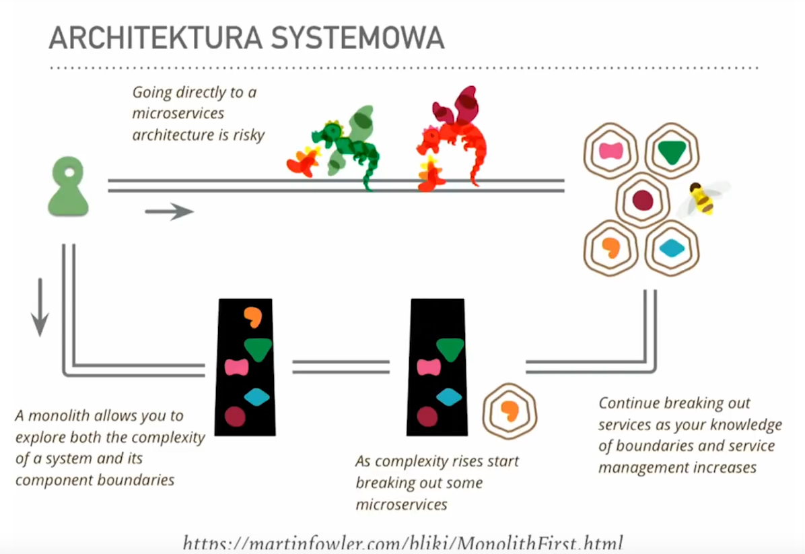
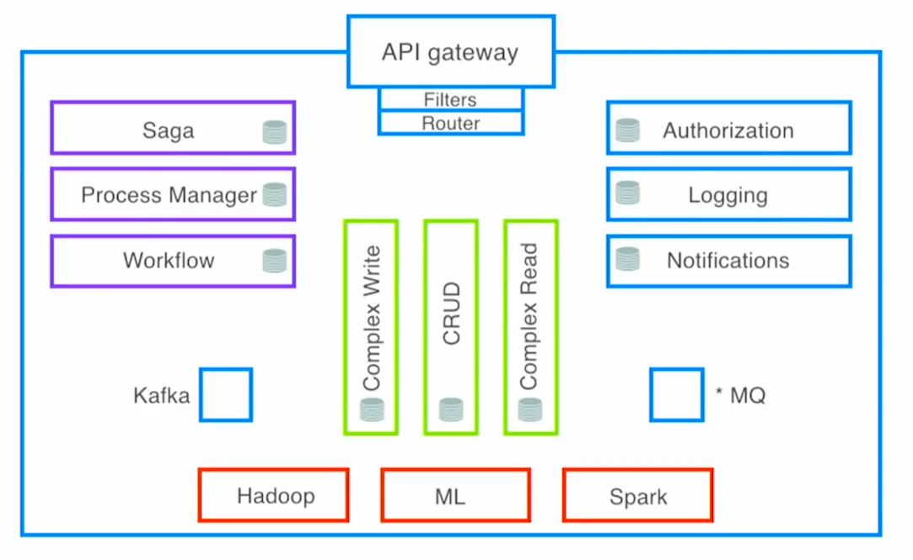
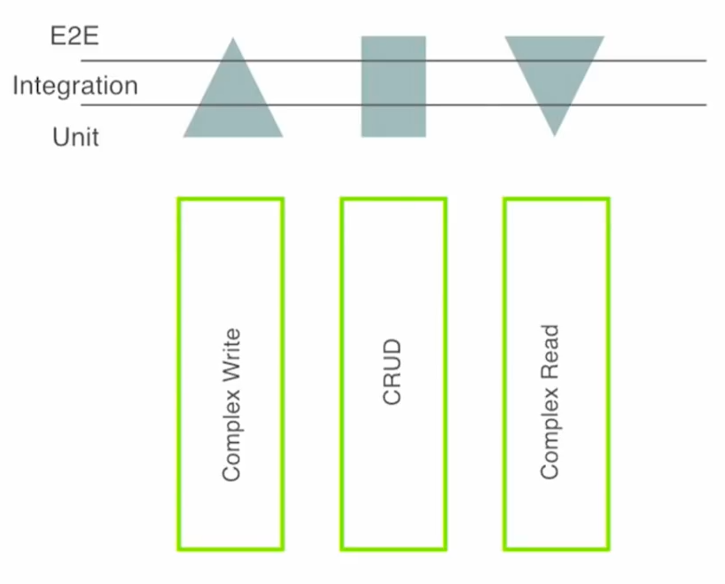

# Modularity - the final frontier

Always start with monolith, modularize correctly and break down a microservice 
if there are architecture characteristics that cannot be satisfied otherwise.

## Modules vs components
Module is a unit of organizing code.  
Component is a runtime instance of a module.  
This relationship is similiar to the one between class (unit of code) and object (unit in runtime).

## Types of services:

### Capability services (Green)
Performs business capability, but not very useful on its own.  
Typically they are time-independent.

### Categories:
- Complex Write  
  Takes only commands, fancy architecture etc.
- Complex Read
- CRUD

### Process services (Violet)
Orchestrates the flow of data and actions between capability services to achieve a specific business process.  
Also takes care of modelling the time dimension and temporal aspects.

#### Categories
- Saga
- Process Manager
- Workflow

### Utility services (Blue)
Takes care of cross-cutting, repetitive, generic concerns

#### Categories (examples)
- Generic supportive domains:
  - Authorization
  - Logging
  - Notifications
- Communication
  - API Gateway
  - Messaging

### Data processing services (Red)
Takes care of reporting etc.

#### Categories (examples)
- Hadoop
- ML
- Spark

## Communication between services
There are only 3 types of possible messages between services
- Event - information what has happened (in the past)
- Query - question about current state (present)
- Command - imperative sentence what should/must happen (in the future)

## Layers of analysis
### System
### Services
### Building blocks
### Objects
Not always OOP, but in general first class citizens of a programming language
### Instructions